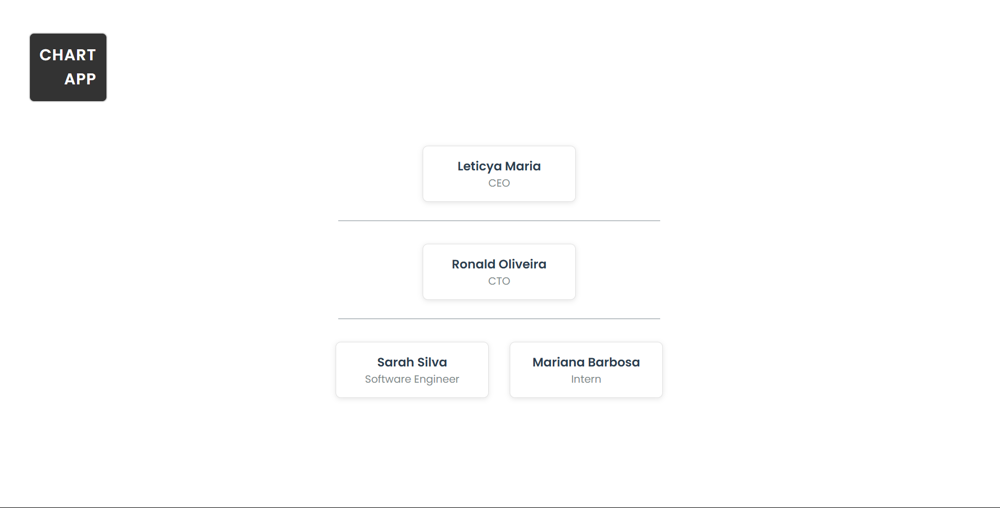

# Organization Chart App

An interactive app for organization chart with drag-and-drop functionality, developed with React (frontend) and FastAPI (backend).



## Features

- Hierarchical view of employees
- Drag-and-drop to change managers
- Hierarchy validations
- Visual feedback with notifications
- Persistence of changes

## Technologies

- **Frontend:**
 -- React (Vite)
 -- TypeScript
 -- react-beautiful-dnd
 -- Axios

- **Backend:**
 -- FastAPI
 -- SQLite
 -- Pydantic
 -- SQLAlchemy

## How to Run

### Backend

1. Navigate to the backend folder:
```bash
cd backend
```

2. Create and activate the virtual environment:
```bash
python -m venv venv
source venv/bin/activate  # Linux/Mac
venv/Scripts/activate     # Windows
```

3. Install the dependencies:
```bash
pip install -r requirements.txt
```

4. Run the server:
```bash
uvicorn main:app --reload
```

### Frontend
1. Navigate to the frontend folder:
```bash
cd frontend
```

2. nstall the dependencies:
```bash
npm install
```

3. Run the server:
```bash
npm run dev
```

4. Access in the browser:
```bash
http://localhost:5173
```

## API endpoints

### GET /employees
Returns list of employees

**Example response:**
```json
[
  {
    "id": 1,
    "name": "Leticya Maria",
    "title": "CEO",
    "manager_id": null
  }
]
```

### PUT /employees/updatemanager
Updates an employee's manager

**Request Body:**
```json
{
    "employee_id": 1,
    "new_manager_id": 2
}
```

**Possible answers:**
| Status      | Message               |
|------------|------------------------|
| 200        | Manager updated successfully |
| 400        | Validation error |
| 404        | ID not found |
| 500        | Internal error |

## Development

### Conventions

- **Commits**: Follow the Conventional Commits pattern
- **Branches**: Feature branches from main
- **Linting**: ESLint + Prettier configured

### Useful Scripts

**Frontend:**
```bash
npm run dev # Start development server
npm run build # Create production build
npm run lint # Run linter
```

**Backend:**
```bash
python -m pytest # Run tests
```

## **License**

This project is open-source and available under the [MIT License](LICENSE).